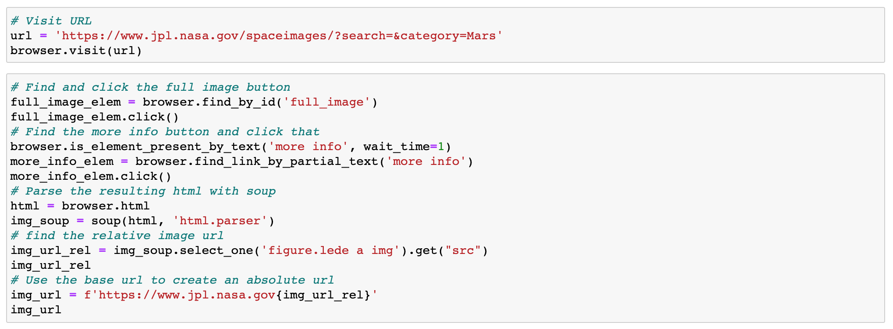
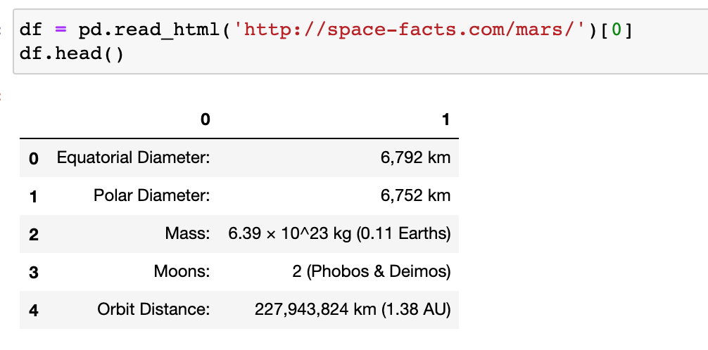
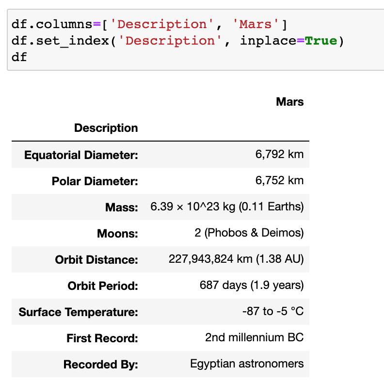
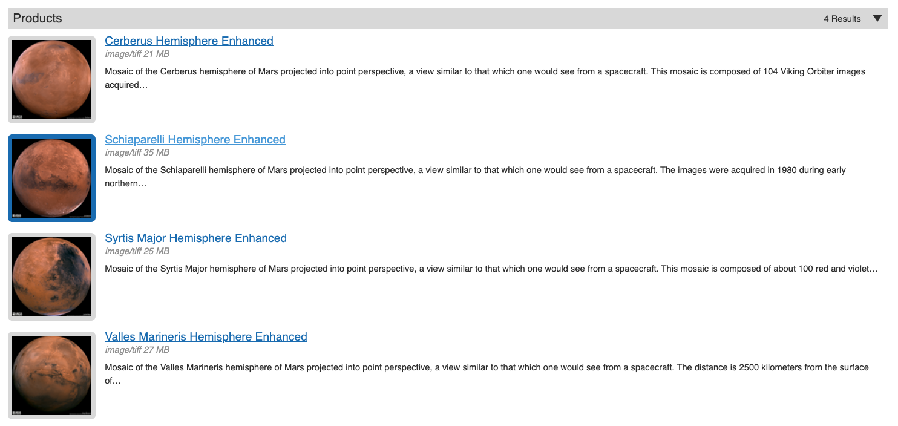
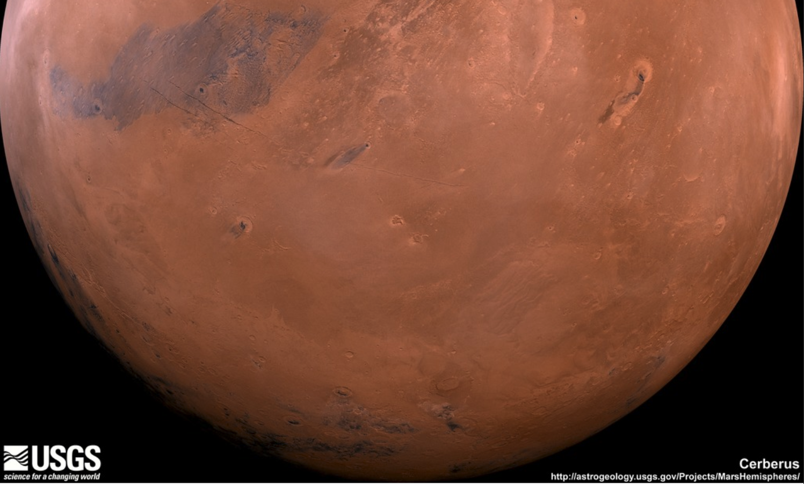

# Mission-to-Mars

## Background and Purpose

The purpose of this project was to scrape from various pages of NASA's website to retrieve useful images and text and placing them on one page using Flask. So basically making it so all the latest information and text could be retrieved very quickly with minnimal effort.

Some of the technologies / programs that were used are Mongo Database, BeautifulSoup, splinter and as well as an index.html file in order to format and display the data retrieved properly. First step in this process was to create a scraping.py file that would scrape all of the data from nasa.gov site , with this informaation it was stored in the database and simultaneouly connected to a an application.

Below you can see some of the actual code , but to further explain ; splinter was used to navigate the nasa.gov site which then transitioned into the scraping.py file which used beautiful soup to scrape from the actual html which returned the output data.

# Results and Analysis

So taking a look below we can see that the website was succesful able to scrape :

* Facts about mars and the actual statistics of different measurments 

* Search results of four hemispheres of mars

* Pulls up full size images of the hemispheres

## Conclusions

All in all, the website serves its function, it makes it possible to scrape images and information and store it all in one click. 
